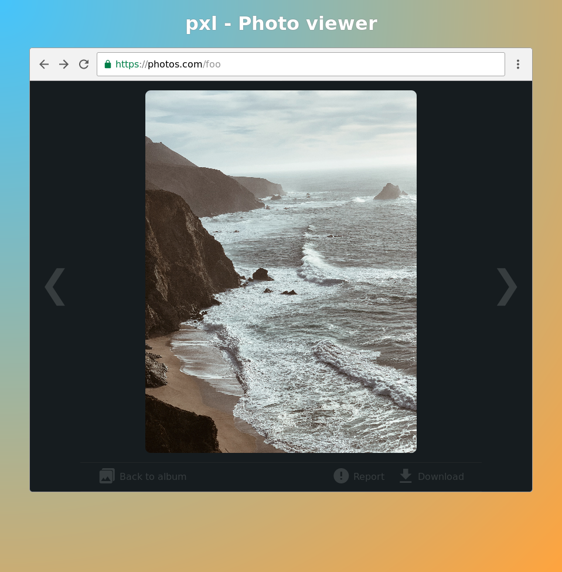

# `pxl`

An S3/DigitalOcean spaces photo management script.



## Documentation

User documentation:

 - [Philosophy and scope](./docs/philosophy.md)
 - [High-level implementation](./docs/high-level-implementation.md)

Conventions and development:

 - [Git conventions](./docs/git-conventions.md)

## Development

`pxl` has the following dependencies:

 - Python 3.7
 - [`pipenv`](https://pipenv.readthedocs.io/en/latest/)

If you have both of those installed, you can:

```
# Get the code (alright you also need git and friends)
$ git clone https://github.com/svsticky/pxl.git

# Create a virtualenv and install dependencies
$ pipenv install

# Run the program
$ pipenv run pxl

# Run the typecheck
$ pipenv run typecheck
```
